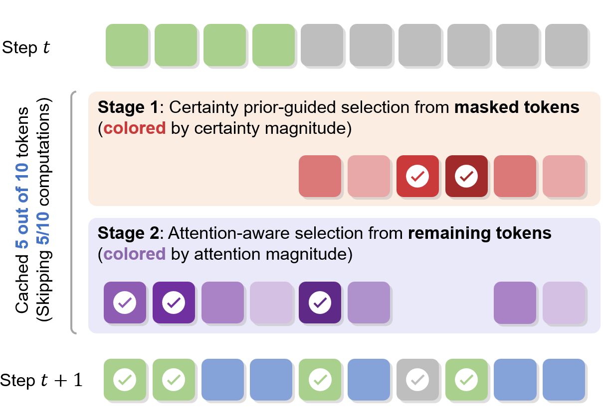

<h1 align="center">	d²Cache: Accelerating Diffusion-Based LLMs via Dual Adaptive Caching </h1>
<p align="center">
<a href="https://arxiv.org/abs/2509.23094">
</a>




**Dual aDaptive Cache (d²Cache)** is a novel, training-free framework that accelerates inference for diffusion-based large language models (dLLMs) while also improving generation quality. It achieves substantial speedups and consistent quality gains over standard decoding and previsou proposed KV cache methods on various representative dLLMs.

 # News
[25/8/30] We released [code reading guides](./docs/code_reading_guides.md), hoping this can help you to grasp our work :)
# Setup
```bash
# Create and activate the environment
conda create -n d2cache python=3.11 -y
conda activate d2cache

# Install dependencies
pip install -r requirements/common.txt

# Prepare dotenv file, and set model path manually 
cp .env.example .env
```


# Evaluation

Run [`scripts/run_eval.sh`](./scripts/run_eval.sh).

Available models:
- llada-base: GSAI-ML/LLaDA-8B-Base
- llada-inst: GSAI-ML/LLaDA-8B-Instruct
- dream-base: Dream-org/Dream-v0-Base-7B
- dream-inst: Dream-org/Dream-v0-Instruct-7B

Available datasets:
- gsm8k
- humaneval
- math-500
- mbpp

Available cache methods:
- no cache (default)
- prefix (Fast-dLLM)
- dllm (dLLM-Cache)
- d2cache (d2Cache)


Additional general arguments can be specified in `configs/geneation/*.yaml` or `configs/gen_args.py`.

>>> [!NOTE]
Batch inference is partially supported and not well tested. If you need this feature, feel free to open an issue or a PR directly!

# Citation
If you find d²Cache useful for your research and applications, please cite using this BibTeX:
```bibtex
@article{jiang2025d2cache,
  title={d$^2$Cache: Accelerating Diffusion-Based LLMs via Dual Adaptive Caching}, 
  author={Yuchu Jiang and Yue Cai and Xiangzhong Luo and Jiale Fu and Jiarui Wang and Chonghan Liu and Xu Yang},
  journal={arXiv preprint arXiv:2509.23094},
  year={2025}
}
```
# Acknowledgment
We would like to thank the authors of [LLaDA](https://github.com/llada-project/llada) and [Dream](https://github.com/dream-project/dream) for their excellent work and open-source contributions. The concurrent KV cache of dLLMs, [Fast-dLLM](https://github.com/NVlabs/Fast-dLLM) and [dLLM-Cache](https://github.com/maomaocun/dLLM-cache) also give us much inspiration.