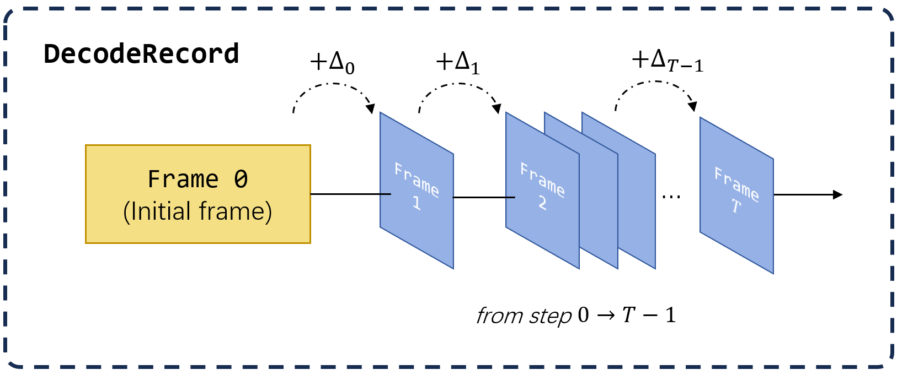
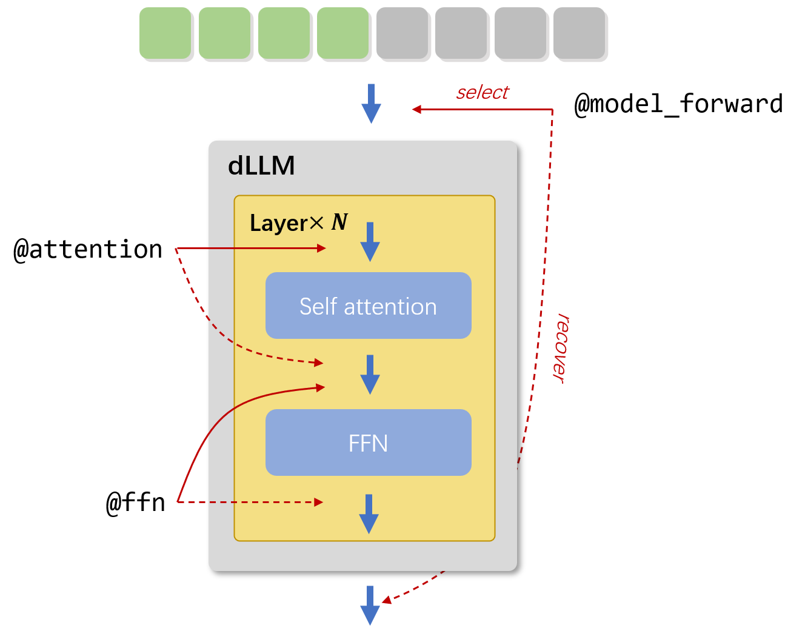

Thank you for your interest in our work. This document provides an overview of the code structure and details our modifications to the Diffusion-based Large Language Models (dLLMs) used in our paper, namely LLaDA and Dream.

# Overall Framework

To facilitate the analysis and logging of the generation process, we have designed three core classes within `src/frame.py`: `DecodeRecord`, `Frame`, and `FrameDelta`. Their relationship is illustrated in the figure above.

- **`Frame`**: Stores comprehensive information about a generation state, including prompts, generated tokens, and the decoding timestep for each previously masked token.
- **`FrameDelta`**: Represents the changes between two consecutive steps. It includes the tokens decoded at a specific step and the indices of any transferred tokens.
- **`DecodeRecord`**: Aggregates the entire decoding trajectory. It consists of an initial `Frame` (containing the prompt and the response segment initialized with mask tokens) and a sequence of $T-1$ `FrameDelta` objects. To reconstruct the state at a specific step $t$, the preceding $t-1$ deltas are sequentially applied to the initial `Frame` using the `Frame.apply_delta` method.

The implementations of the generation methods are located in the `src/generation/` directory.

- `src/generation/vanilla.py` provides the standard decoding process for both LLaDA and Dream. This implementation also incorporates optimizations such as parallel decoding, as proposed in [Fast dLLM](https://arxiv.org/abs/2505.22618), and trivial token debiasing from [PC-Sampler](https://arxiv.org/abs/2508.13021).

- `src/generation/dyna.py` contains the implementation of our proposed method, "decoding with certainty prior".

# Cache Implementation

We have designed a unified interface for caching mechanisms, located in `src/cache.py`. The core logic for token selection and restoration is managed by three key context managers: `@model_forward`, `@attention`, and `@ffn`. These managers are responsible for manipulating the inputs and outputs of their respective modules (the full model, self-attention blocks, and feed-forward networks). The overall process is depicted in the figure below.

As detailed in our [paper](./paper.pdf), the KV caching strategy for dLLMs involves selecting a subset of essential tokens for re-computation, while the states of the remaining tokens are served from the cache.

Specifically, during the self-attention phase, only the selected tokens are passed through the key, value, and query projection matrices. The resulting query vectors (q) then attend to the key-value (KV) pairs of the entire sequence, including those retrieved from the cache. Similarly, in the feed-forward network (FFN) layers, computation is only performed for this selected subset of tokens.

It is important to note that under this strategy, only the logits generated by tokens that are both re-computed and were originally masked are considered valid for the current decoding step.

# Modifications on Modeling

To integrate our caching mechanism into the dLLMs, the primary modifications involve decorating the code within each model layer. Specifically, the `@attention` and `@ffn` context managers must be applied to their respective blocks. Additionally, the `@model_forward` manager should wrap the entire model's forward pass.