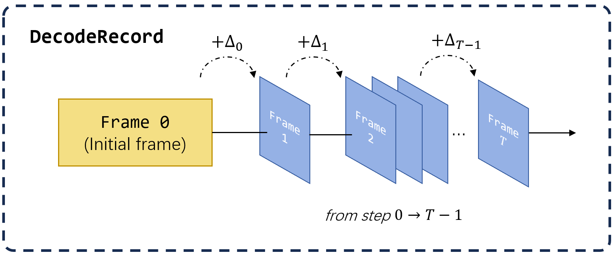
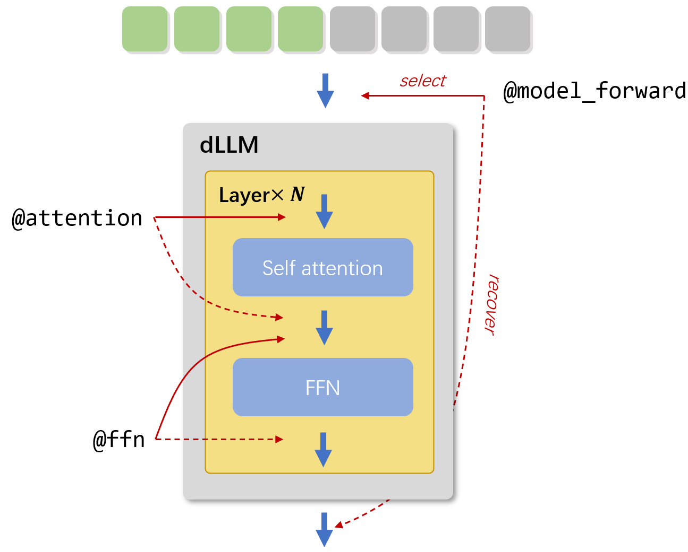

Thank you for your interest in our work. This document provides an overview of the code structure and the model-side hooks used to support Diffusion-based Large Language Models (dLLMs), including LLaDA, Dream, and the SDAR block-diffusion path.

# Overall Framework



To facilitate the analysis and logging of the generation process, we have designed three core classes within `src/frame.py`: `DecodeRecord`, `Frame`, and `FrameDelta`. Their relationship is illustrated in the figure above.

- **`Frame`**: Stores comprehensive information about a generation state, including prompts, generated tokens, and the decoding timestep for each previously masked token. It supports both a single sequence (1D tensors) and a batch of sequences (2D tensors).
- **`FrameDelta`**: Represents the changes between two consecutive steps. It includes the tokens decoded at a specific step and the indices of any transferred tokens. It likewise supports both single-sequence data (for example, `decoded_tokens.shape == (gen_length,)`) and batched data (for example, `decoded_tokens.shape == (batch_size, gen_length)`, excluding finished sequences where applicable).
- **`DecodeRecord`**: Aggregates the entire decoding trajectory. It consists of an initial `Frame` (containing the prompt and the response segment initialized with mask tokens) and a sequence of $T-1$ `FrameDelta` objects. To reconstruct the state at a specific step $t$, the preceding $t-1$ deltas are sequentially applied to the initial `Frame` using the `Frame.apply_delta` method.

The implementations of the generation methods are located in the `src/generation/` directory.

- `src/generation/vanilla.py` provides the standard iterative decoding loop. It handles normal diffusion decoding, block-diffusion decoding, parallel token transfer from [Fast dLLM](https://arxiv.org/abs/2505.22618), and trivial token debiasing from [PC-Sampler](https://arxiv.org/abs/2508.13021), etc.
- `src/generation/ar.py`, `src/generation/klass.py`, and `src/generation/wino.py` provide additional decoding variants that reuse the same `Frame` / `FrameDelta` / cache hook structure.


# Cache Implementation

We have designed a unified interface for caching mechanisms under `src/cache/`. The base interface lives in `src/cache/base.py`, while concrete implementations such as `PrefixCache`, `dLLMCache`, `d2Cache`, and `BlockdCache` live in their own modules. The core logic for token selection and restoration is managed by three context managers: `model_forward`, `attention`, and `ffn`. These managers are responsible for manipulating the inputs and outputs of their respective modules (the full model, self-attention blocks, and feed-forward networks). The overall process is depicted in the figure below.



The KV caching strategy for dLLMs involves selecting a subset of essential tokens for re-computation, while the states of the remaining tokens are served from the cache.

Specifically, during the self-attention phase, only the selected tokens are passed through the key, value, and query projection matrices. The resulting query vectors (q) then attend to the key-value (KV) pairs of the entire sequence, including those retrieved from the cache. Similarly, in the feed-forward network (FFN) layers, computation is only performed for this selected subset of tokens.

It is important to note that under this strategy, only the logits generated by tokens that are both re-computed and were originally masked are considered valid for the current decoding step.

# Modifications on Modeling

To integrate our caching mechanism into the dLLMs, the primary modifications involve wrapping the relevant model code with cache context managers. Specifically, the `attention` and `ffn` context managers are applied inside each decoder block, and `model_forward` wraps the whole model forward pass. Let's illustrate this with examples from LLaDA.

In `LLaDAModel.forward` from [`src/models/llada/modeling_llada.py`](../src/models/llada/modeling_llada.py), we wrap the entire forward pass with `model_forward` to handle input, mask, and logits adjustments:
```python
# x: word embeddings, shape (batch_size, seq_len, hidden_size)
with past_key_values.model_forward(
    x,
    position_ids=position_ids,
    attention_mask=attention_mask,
) as ctx:
    # ctx.input_embeds: the modified input embeddings, shape (batch_size, q_len, hidden_size)
    x = ctx.input_embeds
    position_ids = ctx.position_ids
    attention_mask = ctx.attention_mask

    # Apply blocks one-by-one.
    for block_idx, block in enumerate(self.transformer.blocks):  # type: ignore
        ...

    # Apply final layer norm.
    x = self.transformer.ln_f(x)  # type: ignore
    ...

    # Get logits.
    # shape (batch_size, q_len, vocab_size)
    logits = self.transformer.ff_out(x)  # type: ignore
    ...

    ctx.logits = logits

# After exiting the context, cache implementations that slice the sequence recover logits to
# shape (batch_size, seq_len, vocab_size).
return ctx.logits
```

Similarly, in `LLaDALlamaBlock.forward`, we wrap the attention and FFN blocks:
```python
# x: output of the previous layer, shape (batch_size, q_len, d_model)
residual = x
x = self.attn_norm(x)
with past_key_values.attention(
    self.layer_idx,
    x,
    self.q_proj,
    self.k_proj,
    self.v_proj,
    attention_mask=attention_mask,
) as ctx:
    # ctx.q: query states of the selected tokens, shape (batch_size, num_heads, q_len, head_dim)
    # ctx.k / ctx.v may include cached states after the attention module calls past_key_values.update(...)
    ctx.o, ctx.attn_weights = self.attention(
        ctx.q,
        ctx.k,
        ctx.v,
        ctx.attention_mask,
        position_embeddings=position_embeddings,
    )

# make sure residual has the same shape as ctx.o
x = residual + self.dropout(ctx.o)

# feed-forward projection
# x shape: (batch_size, selected_q_len, d_model)
residual = x
with past_key_values.ffn(self.layer_idx, x) as ctx:
    x = self.ff_norm(ctx.hidden_states)
    ...
    ctx.ffn_out = x

# ctx.ffn_out must match the hidden-state shape expected by the residual path.
x = residual + self.dropout(ctx.ffn_out)
return x
```
